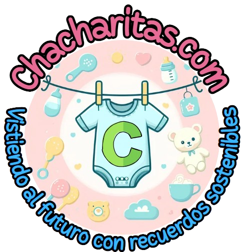

<p align="center"><a href="https://laravel.com" target="_blank"></a></p>

<p align="center">
<a href="https://github.com/laravel/framework/actions"></a>
<a href="https://packagist.org/packages/laravel/framework"></a>
<a href="https://packagist.org/packages/laravel/framework"></a>
<a href="https://packagist.org/packages/laravel/framework"></a>
</p>

## About Laravel

Laravel is a web application framework with expressive, elegant syntax. We believe development must be an enjoyable and creative experience to be truly fulfilling. Laravel takes the pain out of development by easing common tasks used in many web projects, such as:

-   [Simple, fast routing engine](https://laravel.com/docs/routing).
-   [Powerful dependency injection container](https://laravel.com/docs/container).
-   Multiple back-ends for [session](https://laravel.com/docs/session) and [cache](https://laravel.com/docs/cache) storage.
-   Expressive, intuitive [database ORM](https://laravel.com/docs/eloquent).
-   Database agnostic [schema migrations](https://laravel.com/docs/migrations).
-   [Robust background job processing](https://laravel.com/docs/queues).
-   [Real-time event broadcasting](https://laravel.com/docs/broadcasting).

Laravel is accessible, powerful, and provides tools required for large, robust applications.

## Learning Laravel

Laravel has the most extensive and thorough [documentation](https://laravel.com/docs) and video tutorial library of all modern web application frameworks, making it a breeze to get started with the framework.

You may also try the [Laravel Bootcamp](https://bootcamp.laravel.com), where you will be guided through building a modern Laravel application from scratch.

If you don't feel like reading, [Laracasts](https://laracasts.com) can help. Laracasts contains thousands of video tutorials on a range of topics including Laravel, modern PHP, unit testing, and JavaScript. Boost your skills by digging into our comprehensive video library.

## Laravel Sponsors

We would like to extend our thanks to the following sponsors for funding Laravel development. If you are interested in becoming a sponsor, please visit the [Laravel Partners program](https://partners.laravel.com).

### Premium Partners

-   **[Vehikl](https://vehikl.com/)**
-   **[Tighten Co.](https://tighten.co)**
-   **[WebReinvent](https://webreinvent.com/)**
-   **[Kirschbaum Development Group](https://kirschbaumdevelopment.com)**
-   **[64 Robots](https://64robots.com)**
-   **[Curotec](https://www.curotec.com/services/technologies/laravel/)**
-   **[Cyber-Duck](https://cyber-duck.co.uk)**
-   **[DevSquad](https://devsquad.com/hire-laravel-developers)**
-   **[Jump24](https://jump24.co.uk)**
-   **[Redberry](https://redberry.international/laravel/)**
-   **[Active Logic](https://activelogic.com)**
-   **[byte5](https://byte5.de)**
-   **[OP.GG](https://op.gg)**

## Contributing

Thank you for considering contributing to the Laravel framework! The contribution guide can be found in the [Laravel documentation](https://laravel.com/docs/contributions).

## Code of Conduct

In order to ensure that the Laravel community is welcoming to all, please review and abide by the [Code of Conduct](https://laravel.com/docs/contributions#code-of-conduct).

## Security Vulnerabilities

If you discover a security vulnerability within Laravel, please send an e-mail to Taylor Otwell via [taylor@laravel.com](mailto:taylor@laravel.com). All security vulnerabilities will be promptly addressed.

## License

The Laravel framework is open-sourced software licensed under the [MIT license](https://opensource.org/licenses/MIT).

# 🌱 Chacharitas - Plataforma de Comercio Sustentable

<div align="center">
  
  
  [](https://php.net)
  [](https://laravel.com)
  [](LICENSE)
  [](contributing.md)
</div>

## 📖 Descripción del Proyecto

**Chacharitas** es una plataforma web innovadora diseñada para padres mexicanos que buscan comprar y vender ropa para niños y bebés de segunda mano. Nuestro objetivo es combinar **economía circular** con **tecnología moderna** para reducir la contaminación textil y apoyar la economía familiar.

### 🎯 Problema que Resuelve

-   **Sostenibilidad**: Solo el 15% de los residuos textiles se reciclan actualmente
-   **Economía**: Los niños crecen rápidamente, generando gastos constantes en ropa
-   **Calidad**: Ropa infantil de calidad que puede tener una segunda vida útil

### 💡 Propuesta de Valor

-   ✅ **Marketplace especializado** en ropa infantil de segunda mano
-   ✅ **Sistema de verificación de usuarios** con email authentication
-   ✅ **Gestión completa de productos** con imágenes y categorización
-   ✅ **Integración de envíos** con múltiples proveedores logísticos
-   ✅ **Panel de administración** robusto para gestión del negocio
-   ✅ **Diseño responsive** optimizado para dispositivos móviles

## 🛠️ Stack Tecnológico

### Backend

-   **[Laravel 11.9](https://laravel.com/)** - Framework PHP moderno con arquitectura MVC
-   **[PHP 8.2+](https://php.net)** - Lenguaje de programación principal
-   **[MySQL](https://mysql.com)** - Base de datos relacional
-   **[Laravel Fortify](https://laravel.com/docs/fortify)** - Autenticación y verificación de email
-   **[Livewire 3.5](https://laravel-livewire.com/)** - Componentes dinámicos full-stack
-   **[Spatie Laravel Permission](https://spatie.be/docs/laravel-permission/)** - Sistema de roles y permisos

### Frontend

-   **[Tailwind CSS 3.4](https://tailwindcss.com/)** - Framework CSS utility-first
-   **[DaisyUI 4.12](https://daisyui.com/)** - Biblioteca de componentes para Tailwind
-   **[Vite 5.0](https://vitejs.dev/)** - Build tool y bundler moderno
-   **[Alpine.js](https://alpinejs.dev/)** - Framework JavaScript minimalista

### Panel de Administración

-   **[Filament 3.2](https://filamentphp.com/)** - Panel de administración completo con:
    -   CRUD automático para modelos
    -   Dashboard con widgets personalizados
    -   Sistema de notificaciones
    -   Gestión de archivos
    -   Reportes y analytics

### Servicios Externos

-   **[Mailgun](https://mailgun.com)** - Servicio de emails transaccionales
-   **[Shippo API](https://goshippo.com)** - Integración con servicios de envío
-   **[Google Maps API](https://developers.google.com/maps)** - Geolocalización y mapas

### DevOps y Testing

-   **[Pest PHP](https://pestphp.com/)** - Framework de testing moderno
-   **[Laravel Pint](https://laravel.com/docs/pint)** - Code formatter
-   **[GitHub Actions](https://github.com/features/actions)** - CI/CD pipeline
-   **Docker** - Containerización para desarrollo y producción

## 🚀 Funcionalidades Principales

### Para Usuarios

-   👤 **Registro y autenticación** con verificación por email
-   🛍️ **Catálogo de productos** con búsqueda y filtros avanzados
-   📱 **Subida de productos** con wizard intuitivo y múltiples imágenes
-   🗺️ **Sistema de ubicación** automático por código postal
-   📧 **Notificaciones** por email para transacciones importantes
-   💬 **Sistema de contacto** integrado

### Para Administradores

-   📊 **Dashboard completo** con métricas en tiempo real
-   👥 **Gestión de usuarios** con roles y permisos
-   📦 **Administración de productos** y categorías
-   🚚 **Gestión de envíos** y tracking (WIP)

## 🏗️ Arquitectura del Sistema

### Patrones de Diseño Implementados

-   **MVC (Model-View-Controller)** - Separación clara de responsabilidades
-   **Repository Pattern** - Abstracción de acceso a datos
-   **Service Layer** - Lógica de negocio encapsulada
-   **Observer Pattern** - Para eventos del sistema (emails, notificaciones)
-   **Factory Pattern** - Para creación de objetos complejos

### Estructura del Proyecto

```
chacharitas/
├── app/
│   ├── Actions/Fortify/          # Acciones personalizadas de autenticación
│   ├── Console/Commands/         # Comandos Artisan personalizados
│   ├── Filament/                # Panel de administración
│   ├── Http/Controllers/        # Controladores de la aplicación
│   ├── Livewire/               # Componentes Livewire
│   ├── Mail/                   # Clases de email
│   ├── Models/                 # Modelos Eloquent
│   └── Providers/             # Service Providers
├── database/
│   ├── factories/             # Factories para testing
│   ├── migrations/           # Migraciones de base de datos
│   └── seeders/             # Seeders para datos iniciales
├── resources/
│   ├── css/                 # Estilos Tailwind CSS
│   ├── js/                  # JavaScript y Alpine.js
│   └── views/              # Plantillas Blade
└── tests/                  # Tests automatizados
```

## 📋 Requisitos del Sistema

### Servidor de Producción

-   **PHP**: 8.2 o superior
-   **Composer**: 2.x
-   **Node.js**: 18.x o superior
-   **MySQL**: 8.0 o superior
-   **Nginx/Apache**: Servidor web
-   **SSL**: Certificado para HTTPS

### Desarrollo Local

-   **XAMPP/WAMP** o **Laravel Sail** (Docker)
-   **Git**: Para control de versiones
-   **VS Code**: Editor recomendado con extensiones PHP y Laravel

## 🔧 Instalación y Configuración

### 1. Clonar el Repositorio

```bash
git clone https://github.com/Fezto/chacharitas.git
cd chacharitas
```

### 2. Instalar Dependencias

```bash
# Dependencias PHP
composer install

# Dependencias Node.js
npm install
```

### 3. Configuración del Entorno

```bash
# Copiar archivo de configuración
cp .env.example .env

# Generar clave de aplicación
php artisan key:generate

# Configurar base de datos en .env
DB_CONNECTION=mysql
DB_HOST=127.0.0.1
DB_PORT=3306
DB_DATABASE=chacharitas
DB_USERNAME=tu_usuario
DB_PASSWORD=tu_contraseña
```

### 4. Configurar Servicios Externos

```bash
# Mailgun para emails
MAIL_MAILER=mailgun
MAILGUN_DOMAIN=tu-dominio.mailgun.org
MAILGUN_SECRET=tu_secret_key

# Google Maps
GOOGLE_MAPS_KEY=tu_api_key

# Shippo para envíos
SHIPPO_API_TOKEN=tu_token
```

### 5. Ejecutar Migraciones y Seeders

```bash
php artisan migrate --seed
```

### 6. Compilar Assets

```bash
npm run build
```

### 7. Configurar Permisos

```bash
chmod -R 775 storage bootstrap/cache
```

## 🚀 Deployment

### Deployment Automático

El proyecto incluye un script de deployment automatizado:

```bash
# Hacer el script ejecutable
chmod +x deploy.sh

# Ejecutar deployment
./deploy.sh
```

### GitHub Actions

Pipeline de CI/CD configurado que se activa automáticamente en push a `main`:

-   ✅ Ejecuta tests automatizados
-   ✅ Instala dependencias
-   ✅ Compila assets
-   ✅ Despliega a producción

## 🧪 Testing

```bash
# Ejecutar todos los tests
php artisan test

# Tests con coverage
php artisan test --coverage

# Tests específicos
php artisan test --filter=UserTest
```

## 📈 Métricas del Proyecto

-   **Líneas de código**: ~15,000 LOC
-   **Modelos**: 12 modelos principales
-   **Controladores**: 8 controladores
-   **Componentes Livewire**: 6 componentes
-   **Migraciones**: 15 migraciones
-   **Tests**: 50+ tests unitarios y de integración

## 🌍 Impacto Ambiental

### Contribución a la Sostenibilidad

-   **Reducción de residuos textiles**: Extendiendo la vida útil de la ropa infantil
-   **Economía circular**: Promoviendo la reutilización sobre el consumo nuevo
-   **Educación ambiental**: Concientización sobre el impacto del fast fashion

## 👥 Equipo de Desarrollo

**Desarrollador Full-Stack**

-   Diseño y arquitectura del sistema
-   Implementación backend con Laravel
-   Desarrollo frontend con Tailwind CSS
-   Integración de servicios externos
-   DevOps y deployment

## 📞 Contacto y Contribuciones

-   **Email**: chacharitas@gmail.com
-   **Repositorio**: [GitHub](https://github.com/Fezto/chacharitas)
-   **Documentación**: [Wiki del proyecto](https://github.com/Fezto/chacharitas/wiki)

### Contribuir al Proyecto

Las contribuciones son bienvenidas. Por favor:

1. Fork del repositorio
2. Crear branch para la feature (`git checkout -b feature/nueva-funcionalidad`)
3. Commit de cambios (`git commit -am 'Agregar nueva funcionalidad'`)
4. Push al branch (`git push origin feature/nueva-funcionalidad`)
5. Crear Pull Request

## 📄 Licencia

Este proyecto está bajo la Licencia MIT. Ver el archivo [LICENSE](LICENSE) para más detalles.

---

<div align="center">
  <p><strong>🌱 Construyendo un futuro más sustentable, una prenda a la vez</strong></p>
  <p>Hecho con ❤️ en México 🇲🇽</p>
</div>
